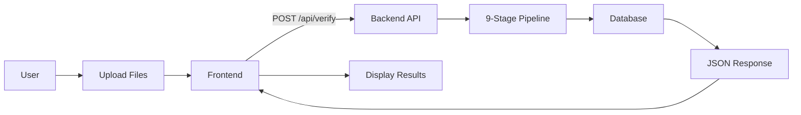
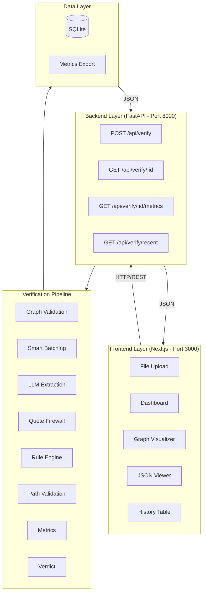
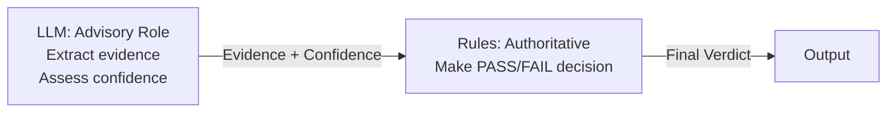
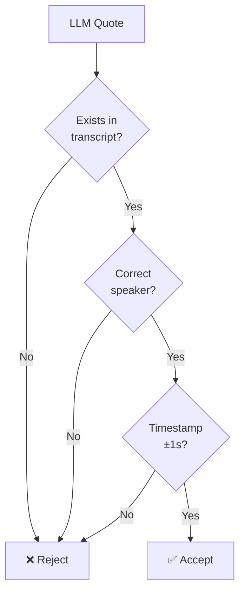

# Architecture Overview

High-level architecture of the Workflow Verification System.

---

## System Architecture Flowchart

```mermaid
flowchart TD
    %% User Interface Layer
    UI["User uploads workflow + transcript<br/>Next.js Frontend (port 3000)"] --> API

    %% API Layer
    API["POST /api/verify<br/>FastAPI Backend (port 8000)"] --> S1

    %% Stage 1: Validation
    S1["Stage 1: Graph Validation<br/>• Validate DAG structure<br/>• Find all valid paths"] --> S2

    %% Stage 2-3: Batching
    S2["Stage 2-3: Smart Batching<br/>NodeClassifier + BatchBuilder<br/>• Classify nodes (anchored/sequential)<br/>• Build time windows<br/>• Batch 2-3 nodes, 50% overlap"] --> S4

    %% Stage 4: LLM
    S4["Stage 4: LLM Evidence Extraction<br/>Anthropic Claude API<br/>• Extract sub-requirements<br/>• Find evidence quotes<br/>• Assess confidence"] --> S5

    %% Stage 5: Firewall
    S5["Stage 5: Quote Verification Firewall<br/>QuoteVerifier<br/>• Verify quote exists (fuzzy match)<br/>• Check speaker correctness<br/>• Validate timestamp (±1s)<br/>❌ Reject hallucinations"] --> S6

    %% Stage 6: Rules
    S6["Stage 6: Deterministic Rule Engine<br/>RuleEngine<br/>• Evaluate node satisfaction<br/>• Apply violation codes (V-01 to V-06)<br/>• Detect unauthorized steps"] --> S7

    %% Stage 7: Validation
    S7["Stage 7: Edge & Path Validation<br/>EdgeValidator<br/>• Validate edge traversal<br/>• Match against valid paths<br/>• Detect order violations"] --> S8

    %% Stage 8: Metrics
    S8["Stage 8: Metrics Calculation<br/>• Node completion rate<br/>• Edge accuracy<br/>• Valid path matched<br/>• 8 total metrics"] --> S9

    %% Stage 9: Verdict
    S9["Stage 9: Final Verdict<br/>PASS = zero critical violations<br/>FAIL = any critical violation"] --> DB

    %% Database
    DB[("SQLite Database<br/>verifications.db<br/>• Verification results<br/>• Metrics JSON<br/>• Workflow/Transcript JSON")] --> EXPORT

    %% Export
    EXPORT["MetricsExportService<br/>Format JSON output"] --> RESPONSE

    %% Response
    RESPONSE["API Response<br/>• Verdict (PASS/FAIL)<br/>• Violations<br/>• Metrics<br/>• Node results"] --> DISPLAY

    %% Display
    DISPLAY["Frontend Display<br/>• Dashboard<br/>• Graph Visualizer<br/>• JSON Viewer<br/>• History Table"]

    %% Error handling
    S4 -. "LLM fails" .-> S5
    S5 -. "Quote rejected" .-> S6
    S6 -. "Critical violation" .-> S9
```

---

## Simplified Data Flow

---

## Component Architecture

---

## Technology Stack

| Layer | Technology | Purpose |
|-------|------------|---------|
| **Frontend** | Next.js 15 | React framework with SSR |
| | TypeScript | Type safety |
| | TailwindCSS | Styling |
| | ReactFlow | Graph visualization |
| **Backend** | FastAPI | Async Python web framework |
| | Pydantic | Data validation |
| | asyncio | Async processing |
| **LLM** | Anthropic Claude | Semantic understanding |
| | LangChain | LLM orchestration |
| **Database** | SQLite + aiosqlite | Local persistence |

---

## Key Components

### **Frontend Services**
- `file-upload.tsx` - Upload workflow + transcript
- `audit-dashboard.tsx` - Display metrics & violations
- `graph-visualizer.tsx` - ReactFlow workflow visualization
- `json-viewer-dialog.tsx` - Formatted JSON popup
- `history-table.tsx` - Past verification list

### **Backend Services**
- `compliance_verifier.py` - Main 9-stage pipeline orchestrator
- `node_classifier.py` - Classify nodes (anchored/sequential)
- `batch_builder.py` - Time-window batching
- `llm_service.py` - Anthropic Claude integration
- `quote_verifier.py` - Hallucination firewall (3-check)
- `rule_engine.py` - Deterministic PASS/FAIL logic
- `edge_validator.py` - Path matching & order validation
- `metrics_export.py` - JSON formatting service

### **Data Models**
- `WorkflowGraph` - Nodes + edges DAG structure
- `Transcript` - Timestamped conversation turns
- `ComplianceResult` - Verdict + violations + metrics
- `NodeVerdict` - Per-node satisfaction status
- `MetricsExport` - Formatted JSON output

---

## Security & Reliability

### **Hybrid Architecture**

**Benefit:** Semantic understanding + deterministic reliability

### **Quote Verification Firewall**

**Impact:** Reduces false positives from ~15% to <1%

---

## Performance Characteristics

- **Processing Time:** ~30-40 seconds for 5-node workflow
- **LLM Calls:** 1-3 per verification (batched)
- **Concurrency:** Async/await for non-blocking I/O
- **Scalability:** Vertical (single-instance, async)
